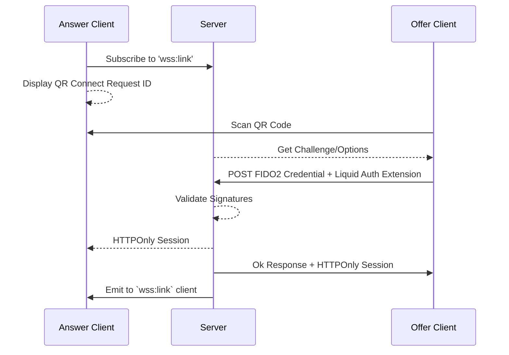
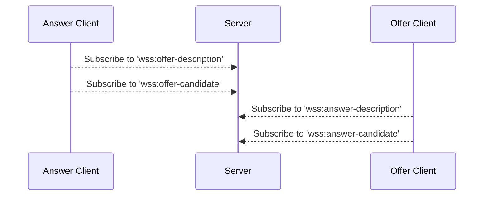
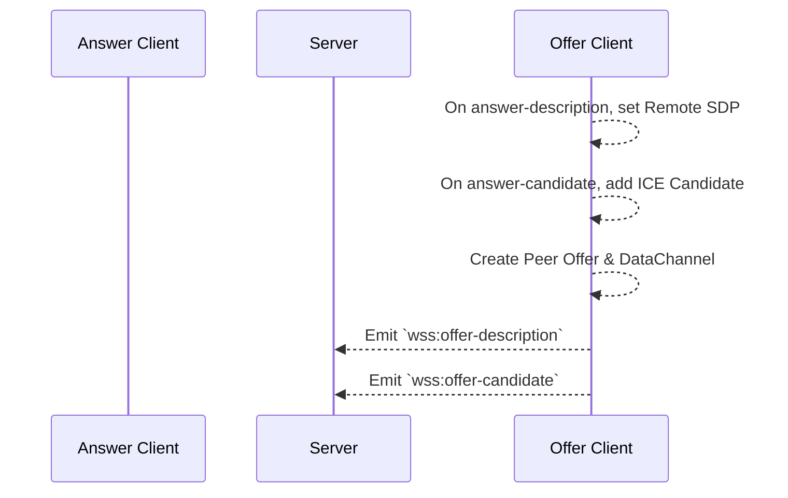
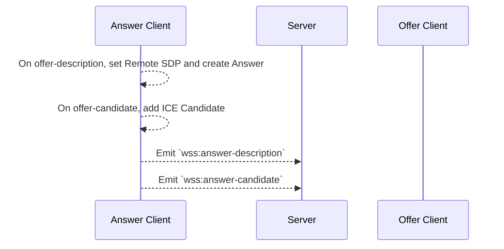
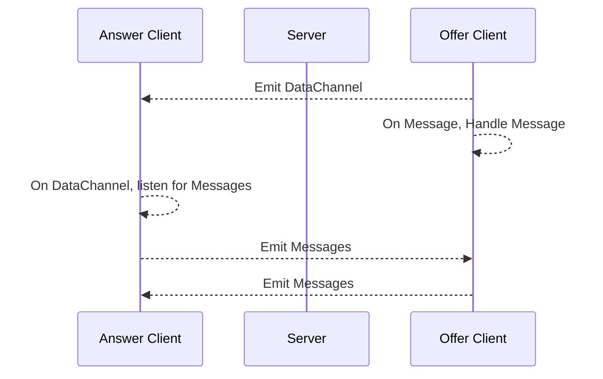

This is a high level overview of the sequence of events that happens while using Liquid Auth.
See the [Getting Started](./guides/getting-started) section for more detailed information on each step.
Diagrams are generated using [Mermaid](https://mermaid-js.github.io/mermaid/#/).

## Authentication

A user can link their device to a website by scanning a QR code. 
The website will subscribe to a WebSocket channel to receive the link status. 
The wallet will scan the QR code and send a [FIDO2 PublicKeyCredential]() to the server. 
The server will validate the FIDO2 credential and send a response to the wallet and website.

## Signaling

The website and wallet can subscribe to an isolated WebSocket channel to broker [Session Description]() answers and offers.
[ICE Candidates]() are discovered when any peer has both an offer and answer.

### Offer

[Offers]() are created by a peer and sent through the signaling service. 
A client with an offer will listen for an answer description. 
Answers are only emitted in response to an offer.
Offer clients are responsible for creating the [Data Channel]().

### Answer

An [Answer]() is created by a peer in response to an offer.
The answer description and candidates are emitted to the signaling service.

### Data Channel

Once an Offer and Answer have been exchanged, a [Data Channel]() will be emitted to the peer who created the answer.
This channel is used to send messages between the website and wallet in real-time over the established P2P connection.

