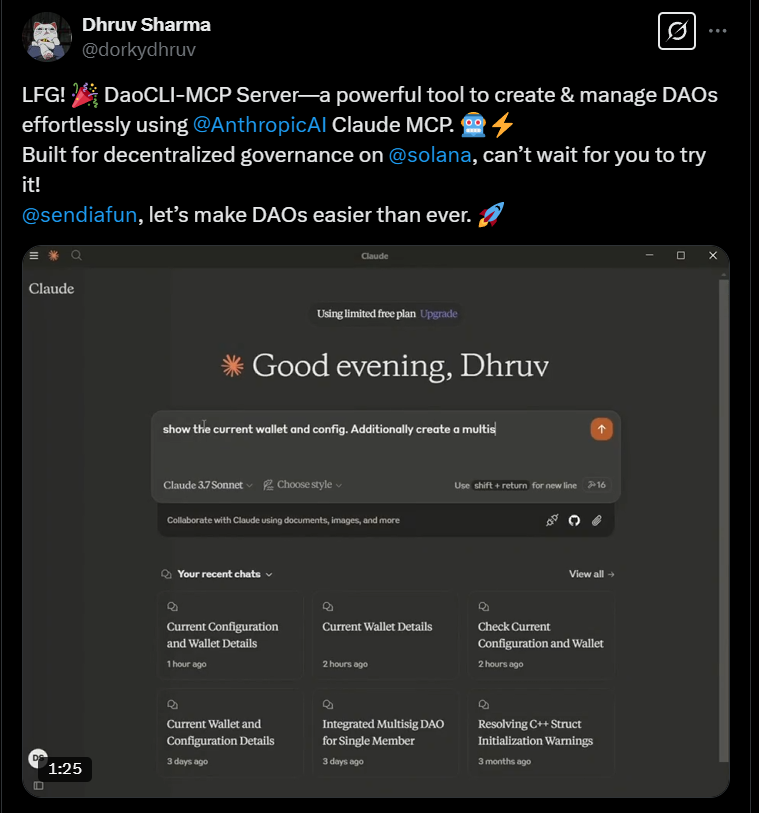

<div align="center">
  <h3>Winner of the Solana MCP AI Agent Competition</h3>  
    <a href="https://x.com/sendaifun/status/1902788122552963460" target="_blank" rel="noopener noreferrer">
    
  </a>
</div>

# assetCLI - Goldman Sachs for AI Agents

assetCLI is a comprehensive AI-native platform for token launches, liquidity management, and team treasury operations on Solana. It leverages the Model Context Protocol (MCP) to provide natural language interactions for all operations.

!assetCLI

### We have no token on Pump.fun, daos.fun or any other platform.

## 🌟 Features

- **Token Launch**: Create tokens with bonding curves for fair price discovery
- **Flexible Base Asset**: Use any SPL_TOKEN or TOKEN_22 standard token as the base for your bonding curve, not just native SOL
- **Advanced Bonding Curve Math**: Utilizes pump science and a linear bonding curve (X=Y*Z, X constant) for AMM price discovery
- **InterfaceAccount Support**: Full compatibility with both SPL_TOKEN and TOKEN_22 standards for mints and token accounts
- **Raydium Integration**: Raydium CPI for CPMM pool creation and locking, with both mainnet and devnet builds (devnet via feature flag)
- **Metaplex Metadata**: On-chain Metaplex program integration for project token metadata
- **SystemAccount Signer PDA**: Bonding curve operations use a SystemAccount signer PDA for secure, programmatic actions
- **Ordered Pair Validation**: CPMM pool creation checks ordered pairs on both client and contract sides
- **Custom Authority & Vault**: Use authority_address and vault_address for asset transfers, enabling use beyond Squads, Realms DAO, etc.
- **Localnet Scripts**: Scripts for local development, including cloning bpf-upgradable programs and system accounts for CPIs
- **Squads Multisig Integration**: Secure team treasury management
- **Automatic Raydium Migration**: Seamless transition to DEX when bonding curves complete
- **Perana/Numeraire Integration**: Access to stable pool swaps and liquidity provisioning
- **Treasury Management**: Fund and manage multisig vaults
- **Wallet Management**: Import, create, and fund wallets
- **[Model Context Protocol (MCP)](https://www.claudemcp.com)**: Natural language interaction for all operations

## Model Context Protocol (MCP) Interface

assetCLI uses the powerful [Model Context Protocol (MCP)](https://www.claudemcp.com/) interface that allows natural language interaction through compatible AI clients like Claude Desktop.

### Setting Up the MCP Interface

#### Prerequisites

- A compatible MCP client (e.g., [Claude Desktop](https://claude.ai/desktop))
- Node.js (v16+)
- pnpm (recommended)

### Configuration

#### Setting up Claude Desktop MCP server

1. Clone the repository and install dependencies:

```bash
# Clone the repository
git clone https://github.com/assetCLI/assetCLI.git
cd assetCLI

# Install dependencies
pnpm install

# Build the project
pnpm build
```

2. Change the Claude Desktop MCP server settings:

For MacOS:

```bash
code ~/Library/Application\ Support/Claude/claude_desktop_config.json
```

For Windows:

```bash
code $env:AppData\Claude\claude_desktop_config.json
```

The final configuration should look like the following:

```json
{
  "mcpServers": {
    "assetCLI": {
      "command": "node",
      "args": ["$(pwd)/dist/mcp-server.js"]
    }
  }
}
```

### Using Natural Language Commands

The MCP interface supports natural language commands. Here are examples of what you can ask:

#### Configuration and Setup

```
Set my cluster to devnet
Import my wallet from ~/.config/solana/id.json
Show me my wallet information
What's the current configuration?
```

#### Multisig Management

```
Create a new multisig wallet called "Project Treasury" with 3 members and a threshold of 2
Show me details about my multisig
Fund my multisig with 0.5 SOL
```

#### Bonding Curve Operations

```
Initialize the bonding curve protocol
Create a new bonding curve token named "Community Token" with symbol "CMT"
Get information about the bonding curve for mint address xyz789
Buy 2 WSOL worth of tokens from the bonding curve
Sell 100 tokens back to the bonding curve
Simulate swapping 1 WSOL for tokens to see expected output
Check if a bonding curve is complete
Migrate a completed bonding curve to Raydium
List all available bonding curve tokens
```

#### Perana Pool Operations

```
List all available Perana pools
Get information about the tripool
Swap 10 USDC for USDT through the Perana pool
Add liquidity to the susd pool
Remove liquidity from the tripool
```

#### Wallet Operations

```
Show my wallet balance
Create a new wallet
Get token balances in my wallet
```

#### Utility Operations

```
Look up transaction signature xyz789
What happened in transaction abc123?
```

### Demo

<div align="center">
  <h4>Watch assetCLI in action with MCP-powered natural language commands</h4>
    <a href="https://x.com/dorkydhruv/status/1901066331400925538">
    
  </a>
  <p>Follow us on <a href="https://www.youtube.com/@assetCLI" target="_blank">YouTube</a> for more demos and tutorials</p>
</div>

---

## 🏗️ Project Structure

```
assetCLI/
├── programs/
│   └── bonding-curve/        # Solana program for bonding curves
├── src/
│   ├── mcp/                  # MCP tools and resources
│   │   ├── bonding-curve.ts  # Bonding curve MCP tools
│   │   ├── config-and-wallet.ts # Wallet configuration tools
│   │   ├── multisig.ts       # Multisig MCP tools
│   │   ├── perana-tools.ts   # Perana integration tools
│   │   └── agent-tools.ts    # Solana-agent-kit DeFi tools
│   ├── services/             # Core business logic
│   │   ├── bonding-curve-service.ts  # Bonding curve implementation
│   │   ├── multisig-service.ts       # Squads multisig implementation
│   │   └── perana-service.ts         # Perana/Numeraire service
│   ├── utils/                # Utility functions
│   ├── types/                # TypeScript type definitions
│   ├── debug/                # Debug scripts for testing
│   └── mcp-server.ts         # MCP server implementation
├── tests/                    # Test files
└── dist/                     # Compiled output
```

## 🧩 Architecture

The application integrates multiple key components:

1. **Bonding Curve Protocol**: For token launches with automatic liquidity and price discovery, supporting both SPL_TOKEN and TOKEN_22 standards
2. **Raydium Integration**: Raydium CPI for CPMM pool creation and locking, with ordered pair validation
3. **Metaplex Metadata**: On-chain metadata for project tokens
4. **SystemAccount Signer PDA**: Secure, programmatic operations for the bonding curve
5. **Custom Authority & Vault**: Flexible asset management for advanced use cases
6. **Squads Multisig**: For multi-signature transaction approval and team treasury management
7. **Perana/Numeraire**: For stable pool operations and liquidity management
8. **[Model Context Protocol (MCP)](https://www.claudemcp.com/)**: For AI-assisted interactions and operations
9. **Solana-Agent-Kit**: Extended DeFi and on-chain operations via MCP
10. **Localnet Scripts**: For local development and testing, including program and account setup

Key workflows include:

1. **Token Launch**: Create a token with bonding curve economics, optionally managed by a Squads multisig
2. **Bonding Phase**: Users buy tokens through the bonding curve, with prices increasing as more tokens are purchased
3. **Completion & Migration**: Once the bonding curve goal is reached, automatic migration to Raydium DEX
4. **Stable Pool Operations**: Interact with Perana's Numeraire pools for stable asset management
5. **DeFi Operations**: Use solana-agent-kit for advanced on-chain actions

## 🛠️ Development

To set up a development environment:

```bash
# Clone the repository
git clone https://github.com/assetCLI/assetCLI-init.git
cd assetCLI-init

# Install dependencies
pnpm install

# Build the project
pnpm build
```

## 🔍 Troubleshooting

- **Insufficient funds errors**: Ensure your wallet has enough SOL
- **Transaction errors**: Verify that you're using correct account addresses
- **"Account not found" errors**: The blockchain might be congested; try again
- **MCP connection issues**: Verify the MCP server is running and accessible
- **Natural language parsing errors**: Try using more specific language or make your request more explicit
- **Bonding curve errors**: Check that you've initialized the bonding curve protocol
- **BN conversion errors**: Ensure decimal amounts are handled properly
- **Perana pool errors**: Verify you're using valid pool names or addresses
- **CPMM/Curve errors**: Ensure ordered pairs and base assets are correct
- **Localnet issues**: Use provided scripts for localnet setup and program deployment

## 📜 License

This project is licensed under the MIT License - see the LICENSE file for details.

---