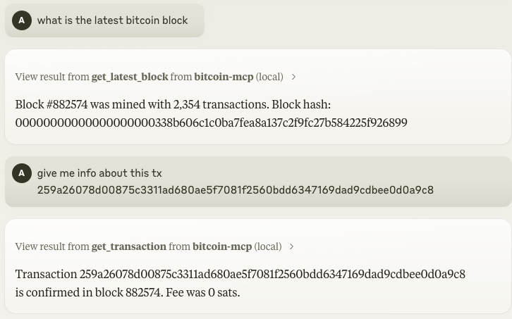
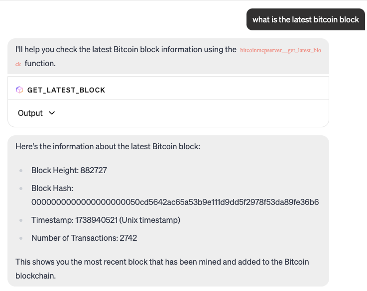

[](https://mseep.ai/app/abdelstark-bitcoin-mcp)

<div align="center">

<a href="https://github.com/AbdelStark/bitcoin-mcp/actions/workflows/ci.yml"></a>
<a href="https://bitcoin.org/"> </a>
<a href="https://modelcontextprotocol.com/"> </a>

</div>

# ₿itcoin & Lightning Network MCP Server

<div align="center">
  <h3>
    <a href="abdelstark.github.io/bitcoin-mcp/">
      Documentation
    </a>
    <span> | </span>
    <a href="https://abdelstark.github.io/bitcoin-mcp/docs/integration/claude-desktop">
      Try with Claude
    </a>
    <span> | </span>
    <a href="https://abdelstark.github.io/bitcoin-mcp/docs/integration/goose">
      Try with Goose
    </a>
  </h3>
</div>

<div align="center">
<a href="https://smithery.ai/server/@AbdelStark/bitcoin-mcp"></a>
<a href="https://www.npmjs.com/package/bitcoin-mcp"></a>
</div>

## Overview

A Model Context Protocol (MCP) server that enables AI models to interact with Bitcoin and Lightning Network, allowing them to generate keys, validate addresses, decode transactions, query the blockchain, and more.

## 🎮 Demo

| Claude Demo [Video](https://github.com/user-attachments/assets/ce7a2665-c276-4a54-a727-b29dd911f8af)         | Goose Demo [Video](https://github.com/user-attachments/assets/7c1e4a05-51cf-435f-bd34-39e8fba6635e) |
| ------------------------------------------------------------------------------------------------------------ | --------------------------------------------------------------------------------------------------- |
|  |           |

## 💼 Table of Contents

- [₿itcoin \& Lightning Network MCP Server](#itcoin--lightning-network-mcp-server)
  - [Overview](#overview)
  - [🎮 Demo](#-demo)
  - [💼 Table of Contents](#-table-of-contents)
  - [🔧 Features](#-features)
  - [🔑 Claude Desktop Integration](#-claude-desktop-integration)
    - [Testing the Claude Desktop Integration](#testing-the-claude-desktop-integration)
  - [🦆 Goose Integration](#-goose-integration)
    - [Using STDIO (Local Extension)](#using-stdio-local-extension)
      - [Using SSE (Remote Extension)](#using-sse-remote-extension)
  - [📦 Development Setup](#-development-setup)
    - [Lightning Network Configuration (Optional)](#lightning-network-configuration-optional)
  - [📦 Available Tools](#-available-tools)
  - [🚨 Error Handling](#-error-handling)
  - [🤝 Contributing](#-contributing)
  - [📝 License](#-license)

## 🔧 Features

- **Key Generation**: Create new Bitcoin key pairs — including address, public key, and private key (WIF).
- **Address Validation**: Validate the correctness of a Bitcoin address.
- **Transaction Decoding**: Parse a raw Bitcoin transaction and display its details in a human-readable format.
- **Blockchain Queries**:
  - **Latest Block**: Retrieve details about the most recent block (hash, height, timestamp, transaction count, etc.).
  - **Transaction Details**: Fetch detailed information about a transaction using its TXID.
- **Lightning Network**:
  - **Invoice Decoding**: Parse a BOLT11 Lightning invoice and display human-readable information.
  - **Payment**: Pay a Lightning invoice directly from your LNBits wallet.

## 🔑 Claude Desktop Integration

To use the Bitcoin MCP server with Claude Desktop (Anthropic's desktop app for Claude), follow these steps:

1. **Download and Install Claude Desktop:** Visit the official Claude Desktop downloads page and get the app for your operating system (macOS or Windows) ([Installing Claude for Desktop | Anthropic Help Center](https://support.anthropic.com/en/articles/10065433-installing-claude-for-desktop#:~:text=1,page)). Install the app and ensure you're using the latest version (you can check for updates in the app menu).

2. **Configure Claude Desktop to use the Bitcoin MCP Server:** Open the Claude Desktop configuration file (it's created when you first edit settings in Claude Desktop):

   - **macOS:** `~/Library/Application Support/Claude/claude_desktop_config.json`
   - **Windows:** `%APPDATA%\Claude\claude_desktop_config.json`  
     Add an entry for the Bitcoin MCP server in this JSON config under the `"mcpServers"` section. For example:

   ```json
   {
     "mcpServers": {
       "bitcoin-mcp": {
         "command": "npx",
         "args": ["-y", "bitcoin-mcp@latest"]
       }
     }
   }
   ```

   In the snippet above, `"bitcoin-mcp"` is an identifier for the server (you can name it whatever you want). The `command` is set to run the `npx` command, and `args` points to the path of your Bitcoin MCP server script or the command to run the server.

3. **Restart Claude Desktop:** Save the `claude_desktop_config.json` file and then **close and reopen Claude Desktop**. On the next launch, Claude will automatically start the Bitcoin MCP server as configured. If Claude Desktop was running, you need to restart it for the changes to take effect.

### Testing the Claude Desktop Integration

Once Claude Desktop is restarted, you can test whether the Bitcoin MCP server is working correctly:

- **Ask Claude a sample question related to Bitcoin.** For example, try asking: _"What's the latest block on the Bitcoin network?"_ If the integration is successful, Claude's response should include the latest block fetched via the MCP server, rather than an "I don't know" or a generic answer. You can also try other queries like _"Give me information about the transaction with TXID abcdef1234567890abcdef1234567890abcdef1234567890abcdef1234567890."_ Claude should use the MCP server's tools to retrieve the data and answer your query.

- **Verify the response:** Claude should return a detailed answer (e.g. the latest block on the Bitcoin network) without errors. If you get an error message or no useful response, the MCP server might not be connected properly.

- **Check Claude's logs (if needed):** Claude Desktop provides log files that can help debug MCP integrations. If the tool isn't responding, check the log files in:
  - **macOS:** `~/Library/Logs/Claude/`
  - **Windows:** `%APPDATA%\Claude\logs\`  
    Look for `mcp.log` for general MCP connection messages, and a file named `mcp-server-bitcoin-mcp.log` (or with whatever name you used) for the MCP server's output/errors. These logs will show if the server started up or if there were any errors (such as a wrong path or exceptions in the server). If you see errors, fix the configuration or environment as needed, then restart Claude Desktop and test again.

## 🦆 Goose Integration

Goose is an open-source AI agent framework by Block that supports extensions via the Model Context Protocol. You can integrate the Bitcoin MCP server as a Goose extension to allow Goose to interact with the Bitcoin blockchain. Goose supports two modes of integration for MCP servers: running the server as a local process (STDIO) or connecting to it as a remote service via Server-Sent Events (SSE). Below are instructions for both methods:

### Using STDIO (Local Extension)

This method runs the Bitcoin MCP server locally as a subprocess of Goose, communicating through standard input/output.

1. **Add a new extension in Goose:** Open Goose's configuration interface. You can do this via the command line by running `goose configure`, or in the Goose Desktop app by going to **Settings > Extensions**. From the menu, choose **"Add Extension."** ([Using Extensions | goose](https://block.github.io/goose/docs/getting-started/using-extensions/#adding-extensions#:~:text=1))

2. **Choose the extension type – Command-Line Extension:** When prompted for the type of extension, select **Command-Line Extension** (in the CLI menu or UI) so that Goose knows it should launch a local command ([Using Extensions | goose](https://block.github.io/goose/docs/getting-started/using-extensions/#adding-extensions#:~:text=3,extension%20you%E2%80%99d%20like%20to%20add)) (as opposed to a built-in or remote extension).

3. **Enter the extension details:** Provide a name and command for the Bitcoin MCP server:

   - **Name:** You can call it "bitcoin", or any identifier (this will be how you refer to the extension).
   - **Command:** Specify how to run the MCP server. For example, if you have the Python script, enter the command to run it. In the CLI configurator, it might ask "What command should be run?" – you would enter:

     ```bash
     npx -y bitcoin-mcp@latest
     ```

     This tells Goose to launch the Bitcoin MCP server ([GitHub - AbdelStark/bitcoin-mcp: Bitcoin MCP Server](https://github.com/AbdelStark/bitcoin-mcp)). (Make sure to use the correct path to your server script or the correct command to run the server, just like in the Claude config.)

   - You typically do not need to add any arguments beyond the script path (unless your server requires special flags). The above command uses the default STDIO transport, which Goose expects for a command-line extension. (In the Goose config file, this would correspond to an entry with `cmd: "npx"` and `args: ["-y", "bitcoin-mcp@latest"]`, with `type: stdio` indicating standard I/O mode ([Using Extensions | goose](https://block.github.io/goose/docs/getting-started/using-extensions/#adding-extensions#:~:text=extensions%3A%20fetch%3A%20name%3A%20GitHub%20cmd%3A,%7D%20type%3A%20stdio)).)

4. **Finalize and enable:** Complete the extension addition. Goose will add this new extension to its configuration (usually `~/.config/goose/config.yaml`). Ensure the extension is **enabled** (if using the CLI wizard, it should be enabled by default once added; in the Goose Desktop app, you can check the Extensions list and toggle it on if it isn't already ([Using Extensions | goose](https://block.github.io/goose/docs/getting-started/using-extensions/#:~:text=%E2%97%87%20%20What%20would%20you,%E2%94%82%20%20%E2%97%BB%20fetch%20%E2%94%94)) ([Using Extensions | goose](https://block.github.io/goose/docs/getting-started/using-extensions/#:~:text=%E2%94%82%20%20%E2%97%BE%20developer%20%E2%94%82,%E2%97%BB%20fetch%20%E2%94%94))).

5. **Start a Goose session with the new extension:** You can now use the extension in Goose. If you're running Goose via CLI, start a session that includes the extension by running:

   ```bash
   goose session --with-extension "bitcoin"
   ```

replacing "bitcoin" with whatever name you gave the extension ([Using Extensions | goose](https://block.github.io/goose/docs/getting-started/using-extensions/#:~:text=Starting%20a%20Session%20with%20Extensions)). (This ensures the session loads the extension. Alternatively, if the extension is enabled globally, Goose Desktop or CLI will automatically have it available in all sessions.)

#### Using SSE (Remote Extension)

This method connects Goose to an already-running MCP server via an HTTP SSE stream. Use this if you want to run the Bitcoin MCP server as a standalone service (possibly on another machine or just independently of Goose).

1. **Launch the MCP server as a standalone service:** Run the Bitcoin MCP server so that it listens for connections. In practice, this means the server needs to be started in a mode that serves an HTTP endpoint for MCP. For example, you might run the server with a specific command or option to listen on a port (such as using an MCP library's built-in web server capabilities or running under a web framework). Ensure the server is reachable at a known URL (e.g., `http://localhost:9000`) and supports the MCP protocol over SSE.

2. **Add a new extension in Goose (Remote):** As before, run `goose configure` or use the Goose UI to **Add Extension** ([Using Extensions | goose](https://block.github.io/goose/docs/getting-started/using-extensions/#adding-extensions#:~:text=1)). This time, choose **Remote Extension** when asked for the type of extension ([Using Extensions | goose](https://block.github.io/goose/docs/getting-started/using-extensions/#adding-extensions#:~:text=3,extension%20you%E2%80%99d%20like%20to%20add)). This tells Goose that it will connect to an external server via SSE.

3. **Enter the remote extension details:** Give the extension a name (e.g., "bitcoin") and provide the server's URL. For the **URL**, enter the base address where the MCP server is running. For instance, if your server is listening on port 9000 on your local machine, you might enter `http://localhost:9000`. Goose will attempt to connect to the MCP server's SSE endpoint at that address. (Goose uses the standard MCP SSE path, which by convention is under the `/mcp/sse` route on the server, you usually just need to supply the host and port, and Goose handles the rest.)

4. **Enable the extension:** After adding the remote extension, ensure it's enabled in Goose's settings (just like in the STDIO case). Only one of the STDIO or SSE extension (with the same tools) needs to be enabled – if you accidentally enable both a local and remote version of the same server, you may want to disable one to avoid confusion.

**Using the Bitcoin MCP extension in Goose:** Once the extension is set up (via either method above) and enabled, you can interact with Goose and query Bitcoin data through it. In a new Goose chat or session, simply ask questions as you normally would. Goose will recognize when to use the Bitcoin MCP tools to fulfill your request. For example:

- _"What's the latest Bitcoin block?"_
- _"Give me information about the transaction with TXID abcdef1234567890abcdef1234567890abcdef1234567890abcdef1234567890."_

When you ask these questions, Goose will invoke the MCP server's tools and return the answer (e.g., the latest Bitcoin block information). You should see Goose responding with up-to-date information pulled from the Bitcoin blockchain via the MCP server.

If Goose does not seem to use the extension (for instance, if it responds that it cannot find the information), make sure the extension is enabled and that the server is running (in SSE mode for remote). You can also run Goose's CLI with verbose logging to see if it attempted to call the extension. Generally, if configured correctly, Goose will automatically discover the MCP server's capabilities and use them when relevant.

**Further Resources:** For more details on Goose extensions and the MCP, refer to the official Goose documentation ([Using Extensions | goose](https://block.github.io/goose/docs/getting-started/using-extensions/#adding-extensions#:~:text=MCP%20Server%20Directory)). The docs include a list of built-in and community extensions and explain how MCP servers integrate into Goose. You can also find a directory of available MCP servers and additional configuration tips in the Goose docs and the Model Context Protocol documentation. This can help if you want to explore more extensions or develop your own.

## 📦 Development Setup

Find the setup instructions in the [Development Setup](https://abdelstark.github.io/bitcoin-mcp/docs/getting-started/development-setup) guide.

### Lightning Network Configuration (Optional)

To use Lightning Network features, you'll need to configure LNBits connection details. These are optional and only required if you plan to use the Lightning Network tools.

```json
{
  "lnbitsUrl": "https://demo.lnbits.com",  
  "lnbitsAdminKey": "your_admin_key",      // Required for making payments
  "lnbitsReadKey": "your_read_key"         // Required for wallet information
}
```

You can obtain these values by:
1. Creating an account at [LNBits](https://lnbits.com/)
2. Creating a new wallet
3. Going to API info to find your API keys

## 📦 Available Tools

Find the available tools in the [API Reference](https://abdelstark.github.io/bitcoin-mcp/docs/api/generate-key) guide.

## 🚨 Error Handling

The server employs custom error types to handle Bitcoin operations and blockchain queries. Detailed error messages are logged using Pino and included in client responses for easier debugging.

## 🤝 Contributing

Contributions and feature requests are welcome! Feel free to submit pull requests or open issues on GitHub.

## 📝 License

This project is licensed under the [MIT License](LICENSE).
