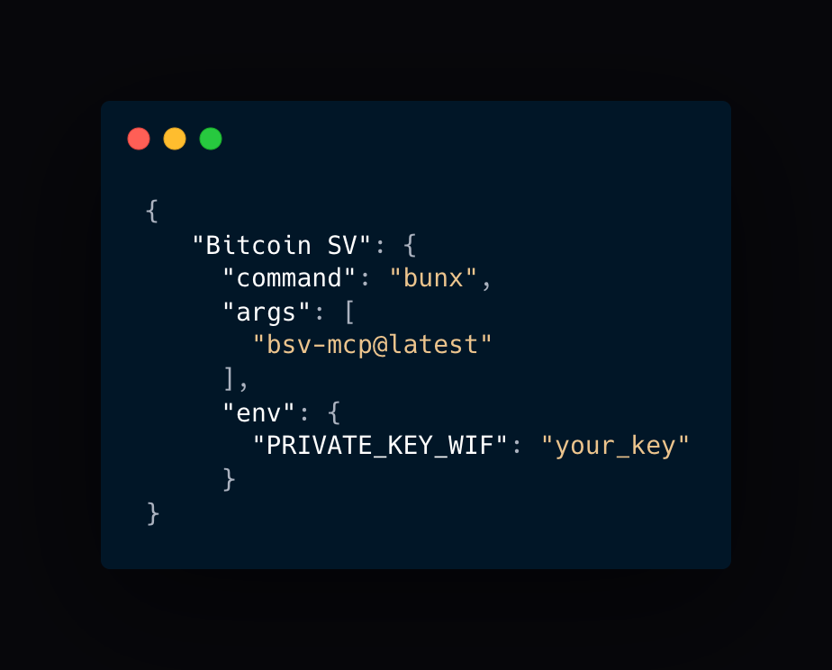

# Bitcoin SV MCP Server

[](https://smithery.ai/server/@b-open-io/bsv-mcp)

> **⚠️ NOTICE: Experimental Work in Progress**  
> This project is in an early experimental stage. Features may change, and the API is not yet stable.
> Contributions, feedback, and bug reports are welcome! Feel free to open issues or submit pull requests.

A collection of Bitcoin SV (BSV) tools for the Model Context Protocol (MCP) framework. This library provides wallet, ordinals, and utility functions for BSV blockchain interaction.

## Installation and Setup

### Use Bun (Optional but recommended)

This project is built using [Bun](https://bun.sh/), a fast JavaScript runtime and package manager. While Bun is recommended for best performance, the server can also run with Node.js and npm as Bun is designed to be backward compatible with node.

#### Installing Bun

**macOS (using Homebrew):**
```bash
brew install oven-sh/bun/bun
```

**macOS/Linux/WSL (using installer script):**
```bash
curl -fsSL https://bun.sh/install | bash
```

**Windows:**
Windows users should use WSL (Windows Subsystem for Linux) or Docker to run Bun.

Node.js and npm will also work but may not offer the same performance benefits.

## Connecting to MCP Clients

This server implements the [Model Context Protocol](https://modelcontextprotocol.io/) (MCP), allowing AI assistants to utilize Bitcoin SV functionalities. You can connect this server to various MCP-compatible clients.



> **Note:** The `PRIVATE_KEY_WIF` environment variable is now optional. Without it, the server runs in limited mode with educational resources and non-wallet tools available. Wallet and MNEE token operations require a valid private key. You can also set the `IDENTITY_KEY_WIF` environment variable to enable sigma-protocol signing of ordinals inscriptions for authentication, curation, and web-of-trust.

### Cursor

To use the BSV MCP server with [Cursor](https://cursor.sh/):

1. Install Cursor if you haven't already
2. Open Cursor and navigate to Settings → Extensions → Model Context Protocol
3. Click "Add a new global MCP server"
4. Enter the following configuration in JSON format:

```json
{
  "mcpServers": {
    "Bitcoin SV": {
      "command": "bunx",
      "args": [
        "bsv-mcp@latest"
      ],
      "env": {
        "PRIVATE_KEY_WIF": "<your_private_key_wif>",
        "IDENTITY_KEY_WIF": "<your_identity_key_wif>"
      }
    }
  }
}
```

5. Replace `<your_private_key_wif>` with your actual private key WIF (keep this secure!) If you dont have one you can leave this off for now but you wont be able to use tools that require a wallet. `<your_identity_key_wif>` is also optional. It will sign 1Sat Ordinals with Sigma protocol using the provided identity key.

6. Click "Save"

The BSV tools will now be available to Cursor's AI assistant under the "Bitcoin SV" namespace.

#### Alternative for npm users

If you prefer to use npm instead of Bun:

```json
{
  "mcpServers": {
    "Bitcoin SV": {
      "command": "npx",
      "args": [
        "bsv-mcp@latest"
      ],
      "env": {
        "PRIVATE_KEY_WIF": "<your_private_key_wif>",
        "IDENTITY_KEY_WIF": "<your_identity_key_wif>"
      }
    }
  }
}
```

### Claude for Desktop

To connect this server to Claude for Desktop:

1. Open [Claude for Desktop](https://claude.ai/desktop) and go to Claude > Settings > Developer
2. Click "Edit Config". 

Open the Claude configuration json file in your favorite text editor. If you prefer to do it from the cli:

   ```bash
   # macOS/Linux
   code ~/Library/Application\ Support/Claude/claude_desktop_config.json

   # Windows
   code %APPDATA%\Claude\claude_desktop_config.json
   ```

3. Add the BSV MCP server to your configuration:
   ```json
   {
     "mcpServers": {
       "Bitcoin SV": {
         "command": "bun",
         "args": [
           "run", "bsv-mcp@latest"
         ],
         "env": {
           "PRIVATE_KEY_WIF": "<your_private_key_wif>",
           "IDENTITY_KEY_WIF": "<your_identity_key_wif>"
         }
       }
     }
   }
   ```
4. Replace `<your_private_key_wif>` with your actual private key WIF
5. Save the file and restart Claude for Desktop
6. The BSV tools will appear when you click the tools icon (hammer) in Claude for Desktop

#### Alternative for npm users (Claude)

If you prefer to use npm instead of Bun, replace the "command" field with "npx".

## Available Tools

The toolkit is organized into several categories:

### Wallet Tools

Wallet tools provide core BSV wallet functionality:

| Tool Name                | Description                                                                                                                                                                                                                                           | Example Output                                                                                            |
| ------------------------ | ----------------------------------------------------------------------------------------------------------------------------------------------------------------------------------------------------------------------------------------------------- | --------------------------------------------------------------------------------------------------------- |
| `wallet_getPublicKey`    | Retrieves a public key for a specified protocol and key ID                                                                                                                                                                                            | `{"publicKey":"032d0c73eb9270e9e009fd1f9dd77e19cf764fbad5f799560c4e8fd414e40d6fc2"}`                      |
| `wallet_createSignature` | Creates a cryptographic signature for the provided data                                                                                                                                                                                               | `{"signature":[144,124,85,193,226,45,140,249,9,177,11,167,33,215,209,38,...]}`                            |
| `wallet_verifySignature` | Verifies a cryptographic signature against the provided data                                                                                                                                                                                          | `{"isValid":true}`                                                                                        |
| `wallet_encryption`      | Combined tool for encrypting and decrypting data using the wallet's cryptographic keys.<br><br>**Examples:**<br>1. Encrypt text: `"Encrypt this message: Hello World"`<br>2. Decrypt data: `"Decrypt this data that was previously encrypted for me"` | Encrypt: `{"ciphertext":[89,32,155,38,125,22,49,226,26,...]}` <br> Decrypt: `{"plaintext":"hello world"}` |
| `wallet_getAddress`      | Returns a BSV address for the current wallet or a derived path                                                                                                                                                                                        | `{"address":"1ExampleBsvAddressXXXXXXXXXXXXXXXXX","status":"ok"}`                                         |
| `wallet_sendToAddress`   | Sends BSV to a specified address (supports BSV or USD amounts)                                                                                                                                                                                        | `{"status":"success","txid":"a1b2c3d4e5f6...","satoshis":1000000}`                                        |
| `wallet_purchaseListing` | Purchases NFTs or BSV-20/BSV-21 tokens from marketplace listings                                                                                                                                                                                      | `{"status":"success","txid":"a1b2c3d4e5f6...","type":"nft","origin":"abcdef123456..."}`                   |
| `wallet_createOrdinals`  | Creates and inscribes ordinals on the BSV blockchain                                                                                                                                                                                                  | `{"txid":"a1b2c3d4e5f6...","inscriptionAddress":"1ExampleAddress...","contentType":"image/png"}`          |

### BSV Tools

Tools for interacting with the BSV blockchain and network:

| Tool Name               | Description                                                                 | Example Output                                                                                     |
| ----------------------- | --------------------------------------------------------------------------- | -------------------------------------------------------------------------------------------------- |
| `bsv_getPrice`          | Gets the current BSV price from an exchange API                             | `Current BSV price: $38.75 USD`                                                                    |
| `bsv_decodeTransaction` | Decodes a BSV transaction and returns detailed information                  | `{"txid":"a1b2c3d4e5f6...","version":1,"locktime":0,"size":225,"inputs":[...],"outputs":[...]}`    |
| `bsv_explore`           | Comprehensive blockchain explorer tool accessing WhatsOnChain API endpoints | `{"chain_info":{"chain":"main","blocks":826458,"headers":826458,"bestblockhash":"0000000000..."}}` |

### Ordinals Tools

Tools for working with ordinals (NFTs) on BSV:

| Tool Name                       | Description                                                                          | Example Output                                                                                                |
| ------------------------------- | ------------------------------------------------------------------------------------ | ------------------------------------------------------------------------------------------------------------- |
| `ordinals_getInscription`       | Retrieves detailed information about a specific inscription                          | `{"id":"a1b2c3d4e5f6...","origin":"a1b2c3d4e5f6...","contentType":"image/png","content":"iVBORw0KGgoAAA..."}` |
| `ordinals_searchInscriptions`   | Searches for inscriptions based on various criteria                                  | `{"results":[{"id":"a1b2c3...","contentType":"image/png","owner":"1Example..."},...]}`                        |
| `ordinals_marketListings`       | Retrieves market listings for NFTs, BSV-20, and BSV-21 tokens with unified interface | `{"results":[{"txid":"a1b2c3...","price":9990000,"tick":"PEPE","listing":true},...]}`                         |
| `ordinals_marketSales`          | Gets information about BSV-20 and BSV-21 token market sales                          | `{"results":[{"txid":"a1b2c3...","price":34710050,"tick":"$BTC","sale":true},...]}`                           |
| `ordinals_getTokenByIdOrTicker` | Retrieves details about a specific BSV20 token by ID                                 | `{"tick":"PEPE","max":"21000000","lim":"1000","dec":"2"}`                                                     |

### Utility Tools

General-purpose utility functions:

| Tool Name           | Description                                                                                                                                                                                                                                                                                                                                                                                                                                                                                                                                                                                                                                                                                                                                                                                                                                                                                                                                      | Example Output                                                 |
| ------------------- | ------------------------------------------------------------------------------------------------------------------------------------------------------------------------------------------------------------------------------------------------------------------------------------------------------------------------------------------------------------------------------------------------------------------------------------------------------------------------------------------------------------------------------------------------------------------------------------------------------------------------------------------------------------------------------------------------------------------------------------------------------------------------------------------------------------------------------------------------------------------------------------------------------------------------------------------------ | -------------------------------------------------------------- |
| `utils_convertData` | Converts data between different encoding formats (utf8, hex, base64, binary).<br><br>**Parameters:**<br>- `data` (required): The string to convert<br>- `from` (required): Source encoding format (utf8, hex, base64, or binary)<br>- `to` (required): Target encoding format (utf8, hex, base64, or binary)<br><br>**Examples:**<br>- UTF-8 to hex: `{"data": "hello world", "from": "utf8", "to": "hex"}` → `68656c6c6f20776f726c64`<br>- UTF-8 to base64: `{"data": "Hello World", "from": "utf8", "to": "base64"}` → `SGVsbG8gV29ybGQ=`<br>- base64 to UTF-8: `{"data": "SGVsbG8gV29ybGQ=", "from": "base64", "to": "utf8"}` → `Hello World`<br>- hex to base64: `{"data": "68656c6c6f20776f726c64", "from": "hex", "to": "base64"}` → `aGVsbG8gd29ybGQ=`<br><br>**Notes:**<br>- All parameters are required<br>- The tool returns the converted data as a string<br>- For binary conversion, data is represented as an array of byte values | `"SGVsbG8gV29ybGQ="` (UTF-8 "Hello World" converted to base64) |

### MNEE Tools

Tools for working with MNEE tokens:

| Tool Name         | Description                                                                                                                                                                           | Example Output                                                                                                                                                                                                                                                                                                                                                                                                                      |
| ----------------- | ------------------------------------------------------------------------------------------------------------------------------------------------------------------------------------- | ----------------------------------------------------------------------------------------------------------------------------------------------------------------------------------------------------------------------------------------------------------------------------------------------------------------------------------------------------------------------------------------------------------------------------------- |
| `mnee_getBalance` | Retrieves the current MNEE token balance for the wallet                                                                                                                               | `{"balance": {"amount": 2900, "decimalAmount": 0.029}}`                                                                                                                                                                                                                                                                                                                                                                             |
| `mnee_sendMnee`   | Send MNEE tokens to a specified address. Supports both MNEE and USD amounts                                                                                                           | `{"success": true, "txid": "d1ce853934964e6c1fe9f44c918a824f175c6ab466b966f49ebc0682a8318895", "rawtx": "0100000002a0be40d8942015f1...", "mneeAmount": 0.01, "usdAmount": "$0.01", "recipient": "15mNxEkyKJXPD8amic6oLUjS45zBKQQoLu"}`                                                                                                                                                                                              |
| `mnee_parseTx`    | Parse an MNEE transaction to get detailed information about its operations and amounts. All amounts are in atomic units with 5 decimal precision (e.g. 1000 atomic units = 0.01 MNEE) | `{"txid": "d1ce853934964e6c1fe9f44c918a824f175c6ab466b966f49ebc0682a8318895", "environment": "production", "type": "transfer", "inputs": [{"address": "18izL7Wtm2fx3ALoRY3MkY2VFSMjArP62D", "amount": 2900}], "outputs": [{"address": "15mNxEkyKJXPD8amic6oLUjS45zBKQQoLu", "amount": 1000}, {"address": "19Vq2TV8aVhFNLQkhDMdnEQ7zT96x6F3PK", "amount": 100}, {"address": "18izL7Wtm2fx3ALoRY3MkY2VFSMjArP62D", "amount": 1800}]}` |

## Using the Tools with MCP

Once connected, you can use natural language to interact with Bitcoin SV through your AI assistant. Here are some example prompts:

### Wallet Operations

- "Get my Bitcoin SV address"
- "Send 0.01 BSV to 1ExampleBsvAddressXXXXXXXXXXXXXXXXX"
- "Send $5 USD worth of BSV to 1ExampleBsvAddressXXXXXXXXXXXXXXXXX"
- "Send 0.01 MNEE to 1ExampleBsvAddressXXXXXXXXXXXXXXXXX"
- "Check my MNEE balance"
- "Parse this MNEE transaction: txid"
- "Encrypt this message using my wallet's keys"
- "Decrypt this data that was previously encrypted for me"
- "Purchase this NFT listing: txid_vout"
- "Purchase this BSV-20 token listing: txid_vout"

### Ordinals (NFTs)

- "Show me information about the NFT with outpoint 6a89047af2cfac96da17d51ae8eb62c5f1d982be2bc4ba0d0cd2084b7ffed325_0"
- "Search for Pixel Zoide NFTs"
- "Show me the current marketplace listings for BSV NFTs"
- "Show me BSV-20 token listings for ticker PEPE"
- "Get recent BSV-20 token sales"

### Blockchain Operations

- "What is the current BSV price?"
- "Decode this BSV transaction: (transaction hex or ID)"
- "Get the latest Bitcoin SV chain information"
- "Show me block details for height 800000"
- "Explore transaction history for address 1ExampleBsvAddressXXXX"
- "Check unspent outputs (UTXOs) for my wallet address"
- "Get details for transaction with hash a1b2c3d4e5f6..."

### Data Conversion

- "Convert 'Hello World' from UTF-8 to hex format"

## MCP Prompts and Resources

The BSV MCP server exposes specialized prompts and resources that provide detailed information and context about Bitcoin SV technologies. These can be accessed by AI models to enhance their understanding and capabilities.

### Available Prompts

The server provides the following educational prompts that can be accessed directly via the MCP protocol:

#### Ordinals Prompt
- **Identifier**: `bitcoin_sv_ordinals`
- **Description**: Comprehensive information about Bitcoin SV ordinals, including what they are, how they work, and how to use them.
- **Usage**: Ask the assistant about "Bitcoin SV ordinals" or "1Sat Ordinals" to access this information.

#### BSV SDK Prompts
A collection of prompts providing detailed information about the Bitcoin SV SDK:

- **Overview**
  - **Identifier**: `bitcoin_sv_sdk_overview`
  - **Description**: General overview of the Bitcoin SV SDK, including its purpose and main components.
  - **Usage**: "Tell me about the BSV SDK" or "What is the Bitcoin SV SDK?"

- **Wallet Operations**
  - **Identifier**: `bitcoin_sv_sdk_wallet`
  - **Description**: Information about wallet operations in the BSV SDK.
  - **Usage**: "How do wallet operations work in the BSV SDK?"

- **Transaction Building**
  - **Identifier**: `bitcoin_sv_sdk_transaction`
  - **Description**: Details about transaction creation and manipulation.
  - **Usage**: "Explain BSV SDK transaction building" or "How do I create transactions with BSV SDK?"

- **Authentication**
  - **Identifier**: `bitcoin_sv_sdk_auth`
  - **Description**: Authentication and identity protocols in BSV SDK.
  - **Usage**: "How does authentication work with BSV SDK?"

- **Cryptography**
  - **Identifier**: `bitcoin_sv_sdk_cryptography`
  - **Description**: Signing, encryption, and verification functionality.
  - **Usage**: "Explain BSV SDK cryptography features"

- **Scripting**
  - **Identifier**: `bitcoin_sv_sdk_script`
  - **Description**: Bitcoin scripting and contract capabilities.
  - **Usage**: "How do I work with Bitcoin scripts using the BSV SDK?"

- **Primitives**
  - **Identifier**: `bitcoin_sv_sdk_primitives`
  - **Description**: Core data types and structures in the BSV SDK.
  - **Usage**: "What primitives are available in the BSV SDK?"

### Available Resources

The server also provides access to Bitcoin Request for Comments (BRC) specifications and documentation:

#### Changelog Resource
- **Identifier**: `bsv-mcp-changelog`
- **Description**: Version history and changelog for the BSV MCP server.
- **Usage**: "Show me the BSV MCP changelog" or "What's new in the latest version?"

#### BRC Resources
- **BRCs Overview**
  - **Identifier**: `brcs_readme`
  - **Description**: Overview of all Bitcoin SV protocol specifications in the BRCs repository.
  - **Usage**: "Show me the Bitcoin SV BRCs overview"

- **BRCs Summary**
  - **Identifier**: `brcs_summary`
  - **Description**: Table of contents for all Bitcoin SV BRCs.
  - **Usage**: "Give me a summary of Bitcoin SV BRCs"

- **Specific BRC Specifications**
  - **Identifier**: `brc_spec`
  - **Description**: Access specific BRC specifications by category and number.
  - **Usage**: "Show me BRC 8 on Transaction Envelopes" or "What does BRC 1 specify?"

#### BRC Categories
The BRC specifications are organized into the following categories:
- Wallet
- Transactions
- Scripts
- Tokens
- Overlays
- Payments
- Peer-to-Peer
- Key Derivation
- Outpoints
- Opinions
- State Machines
- Apps

### Using Prompts and Resources

AI models can use these prompts and resources to provide more accurate and detailed responses about Bitcoin SV technologies. As a user, you can:

1. **Ask about a specific topic**: "Tell me about Bitcoin SV ordinals" or "Explain BSV SDK transaction building"
2. **Request specific BRC details**: "What does BRC 8 specify?" or "Show me the BRC on Transaction Creation"
3. **Get general overviews**: "What is the BSV SDK?" or "Show me a summary of all BRCs"

These prompts and resources enhance the AI's knowledge base, enabling more technical and accurate responses even for complex Bitcoin SV topics.

## How MCP Works

When you interact with an MCP-enabled AI assistant:

1. The AI analyzes your request and decides which tools to use
2. With your approval, it calls the appropriate BSV MCP tool
3. The server executes the requested operation on the Bitcoin SV blockchain
4. The results are returned to the AI assistant
5. The assistant presents the information in a natural, conversational way

## Customization Options

The BSV MCP server can be customized using environment variables to enable or disable specific components:

### Component Configuration

| Environment Variable | Default | Description |
| -------------------- | ------- | ----------- |
| `DISABLE_PROMPTS` | `false` | Set to `true` to disable all educational prompts |
| `DISABLE_RESOURCES` | `false` | Set to `true` to disable all resources (BRCs, changelog) |
| `DISABLE_TOOLS` | `false` | Set to `true` to disable all tools |

### Tool-Specific Configuration

| Environment Variable | Default | Description |
| -------------------- | ------- | ----------- |
| `DISABLE_WALLET_TOOLS` | `false` | Set to `true` to disable Bitcoin wallet tools |
| `DISABLE_MNEE_TOOLS` | `false` | Set to `true` to disable MNEE token tools |
| `DISABLE_BSV_TOOLS` | `false` | Set to `true` to disable BSV blockchain tools |
| `DISABLE_ORDINALS_TOOLS` | `false` | Set to `true` to disable Ordinals/NFT tools |
| `DISABLE_UTILS_TOOLS` | `false` | Set to `true` to disable utility tools |
| `IDENTITY_KEY_WIF`    | `not set` | Optional WIF for identity key; if set, ordinals inscriptions will be signed with sigma-protocol for authentication, curation, and web-of-trust. |
| `DISABLE_BROADCASTING` | `false` | Set to `true` to disable transaction broadcasting; returns raw transaction hex instead - useful for testing and transaction review before broadcasting |

### Examples

Run with only educational resources and prompts, no tools:

```bash
DISABLE_TOOLS=true bunx bsv-mcp@latest
```

Run with only BSV tools, no wallet or other functionality:

```bash
DISABLE_PROMPTS=true DISABLE_RESOURCES=true DISABLE_WALLET_TOOLS=true DISABLE_MNEE_TOOLS=true DISABLE_ORDINALS_TOOLS=true DISABLE_UTILS_TOOLS=true bunx bsv-mcp@latest
```

Use all tools except wallet operations:

```bash
DISABLE_WALLET_TOOLS=true bunx bsv-mcp@latest
```

Create transactions without broadcasting them (dry-run mode):

```bash
DISABLE_BROADCASTING=true bunx bsv-mcp@latest
```

## Troubleshooting

If you're having issues with the BSV MCP server:

### Connection Issues

1. Make sure Bun or Node.js is installed on your system
2. Verify your WIF private key is correctly set in the environment
3. Check that your client supports MCP and is properly configured
4. Look for error messages in the client's console output

### Keeping Bun Up to Date

It's important to keep Bun updated to the latest version to ensure compatibility:

```bash
# Update Bun to the latest version
bun upgrade
```

To verify your current Bun version:
```bash
bun --version
```

### Logging and Debugging

For Claude for Desktop, check the logs at:

```bash
# macOS/Linux
tail -n 20 -f ~/Library/Logs/Claude/mcp*.log

# Windows
type %APPDATA%\Claude\Logs\mcp*.log
```

For Cursor, check the Cursor MCP logs in Settings → Extensions → Model Context Protocol.

## Recent Updates

- **Transaction Broadcast Control**: Added `DISABLE_BROADCASTING` environment variable to prevent transactions from being broadcast to the network
- **Blockchain Explorer**: Added `bsv_explore` tool for WhatsOnChain API access with mainnet/testnet support
- **Unified Tools**: Merged `wallet_encrypt`/`wallet_decrypt` into single `wallet_encryption` tool
- **Enhanced Marketplace**: Support for NFTs, BSV-20/21 tokens in listings, sales and purchases
- **Performance**: Added price caching and optimized API endpoint structure
- **Improved Validation**: Better error handling for private keys and parameters

## Bitcoin SV Blockchain Explorer

The `bsv_explore` tool provides comprehensive access to the Bitcoin SV blockchain through the WhatsOnChain API. This powerful explorer tool allows you to query various aspects of the blockchain, including chain data, blocks, transactions, and address information.

### Available Endpoints

The tool supports the following endpoint categories and specific endpoints:

#### Chain Data

| Endpoint             | Description                                     | Required Parameters | Example Response                                                                      |
| -------------------- | ----------------------------------------------- | ------------------- | ------------------------------------------------------------------------------------- |
| `chain_info`         | Network statistics, difficulty, and chain work  | None                | `{"chain":"main","blocks":826458,"headers":826458,"bestblockhash":"0000000000..."}` |
| `chain_tips`         | Current chain tips including heights and states | None                | `[{"height":826458,"hash":"000000000000...","branchlen":0,"status":"active"}]`        |
| `circulating_supply` | Current BSV circulating supply                  | None                | `{"bsv":21000000}`                                                                    |
| `peer_info`          | Connected peer statistics                       | None                | `[{"addr":"1.2.3.4:8333","services":"000000000000...","lastsend":1621234567}]`        |

#### Block Data

| Endpoint              | Description                                         | Required Parameters                 | Example Response                                                           |
| --------------------- | --------------------------------------------------- | ----------------------------------- | -------------------------------------------------------------------------- |
| `block_by_hash`       | Complete block data via hash                        | `blockHash`                         | `{"hash":"000000000000...","confirmations":1000,"size":1000000,...}`       |
| `block_by_height`     | Complete block data via height                      | `blockHeight`                       | `{"hash":"000000000000...","confirmations":1000,"size":1000000,...}`       |
| `tag_count_by_height` | Stats on tag count for a specific block             | `blockHeight`                       | `{"tags":{"amp":3,"bitkey":5,"metanet":12,"planaria":7,"b":120}}`          |
| `block_headers`       | Retrieves the last 10 block headers                 | None                                | `[{"hash":"000000000000...","height":826458,"version":536870912,...},...]` |
| `block_pages`         | Retrieves pages of transaction IDs for large blocks | `blockHash`, optional: `pageNumber` | `["tx1hash","tx2hash","tx3hash",...]`                                      |

#### Stats Data

| Endpoint                | Description                               | Required Parameters          | Example Response                                                                       |
| ----------------------- | ----------------------------------------- | ---------------------------- | -------------------------------------------------------------------------------------- |
| `block_stats_by_height` | Block statistics for a specific height    | `blockHeight`                | `{"size":123456,"txCount":512,"outputTotal":54.12345678,"outputTotalUsd":2345.67,...}` |
| `block_miner_stats`     | Block mining statistics for a time period | optional: `days` (default 7) | `{"blocks":{"miner1":412,"miner2":208,...},"total":1008}`                              |
| `miner_summary_stats`   | Summary of mining statistics              | optional: `days` (default 7) | `{"totalBlocks":1008,"totalFees":1.23456789,"totalFeesUsd":53.67,...}`                 |

#### Transaction Data

| Endpoint          | Description                                   | Required Parameters | Example Response                                                                           |
| ----------------- | --------------------------------------------- | ------------------- | ------------------------------------------------------------------------------------------ |
| `tx_by_hash`      | Detailed transaction data                     | `txHash`            | `{"txid":"a1b2c3d4e5f6...","version":1,"locktime":0,"size":225,...}`                       |
| `tx_raw`          | Raw transaction hex data                      | `txHash`            | `"01000000012345abcdef..."`                                                                |
| `tx_receipt`      | Transaction receipt                           | `txHash`            | `{"blockHash":"000000000000...","blockHeight":800000,"confirmations":26458}`               |
| `bulk_tx_details` | Retrieve multiple transactions in one request | `txids` (array)     | `[{"txid":"a1b2c3d4e5f6...","version":1,...}, {"txid":"b2c3d4e5f6a7...","version":1,...}]` |

#### Address Data

| Endpoint          | Description                     | Required Parameters          | Example Response                                                |
| ----------------- | ------------------------------- | ---------------------------- | --------------------------------------------------------------- |
| `address_history` | Transaction history for address | `address`, optional: `limit` | `[{"tx_hash":"a1b2c3d4e5f6...","height":800000},...]`           |
| `address_utxos`   | Unspent outputs for address     | `address`                    | `[{"tx_hash":"a1b2c3d4e5f6...","tx_pos":0,"value":100000},...]` |

#### Network

| Endpoint | Description      | Required Parameters | Example Response      |
| -------- | ---------------- | ------------------- | --------------------- |
| `health` | API health check | None                | `{"status":"synced"}` |

### Usage Examples

The `bsv_explore` tool can be used with natural language prompts like:

```
"Get the current Bitcoin SV blockchain information"
"Show me block #800000 details"
"Get tag count statistics for block #800000"
"Fetch transaction history for address 1ExampleBsvAddressXXXXXXXX"
"Get unspent outputs for my wallet address"
"Check transaction details for txid a1b2c3d4e5f6..."
"What is the current BSV circulating supply?"
"Show me the latest block headers"
"Get transaction IDs for page 2 of a large block"
"Show me block statistics for height 800000"
"What are the mining statistics for the last 14 days?"
"Get a summary of mining activity over the past 30 days"
"Retrieve details for multiple transactions in a single query"
```

Under the hood, the tool accepts parameters to specify which data to retrieve:

- `endpoint`: The specific WhatsOnChain endpoint to query (e.g., `chain_info`, `tx_by_hash`)
- `network`: The BSV network to use (`main` or `test`)
- Additional parameters as required by the specific endpoint:
  - `blockHash`: For block_by_hash and block_pages endpoints
  - `blockHeight`: For block_by_height, tag_count_by_height, and block_stats_by_height endpoints
  - `pageNumber`: For block_pages endpoint (pagination)
  - `days`: For block_miner_stats and miner_summary_stats endpoints (defaults to 7)
  - `txHash`: For transaction-related endpoints (tx_by_hash, tx_raw, tx_receipt)
  - `txids`: For bulk_tx_details endpoint (array of transaction IDs)
  - `address`: For address-related endpoints
  - `limit`: Optional pagination limit for address_history

### Network Options

The tool supports both mainnet and testnet:

- `main`: Bitcoin SV mainnet (default)
- `test`: Bitcoin SV testnet

# Development

## Project Setup

If you want to contribute to the project or run it locally:

1. Clone the repository:
   ```bash
   git clone https://github.com/b-open-io/bsv-mcp.git
   cd bsv-mcp
   ```

2. Install dependencies:
   ```bash
   bun install
   # or with npm
   npm install
   ```

## Running the Server

```bash
bun run index.ts
# or with npm
npm run start
```

### Running Tests

```bash
bun test
# or with npm
npm test
```

## License

This project is licensed under the MIT License - see the [LICENSE](LICENSE) file for details.
