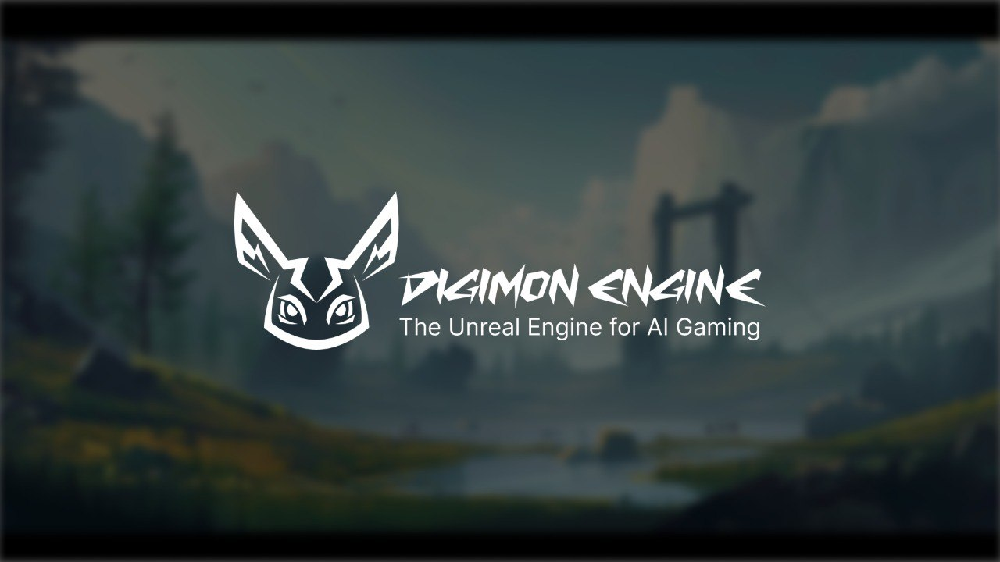
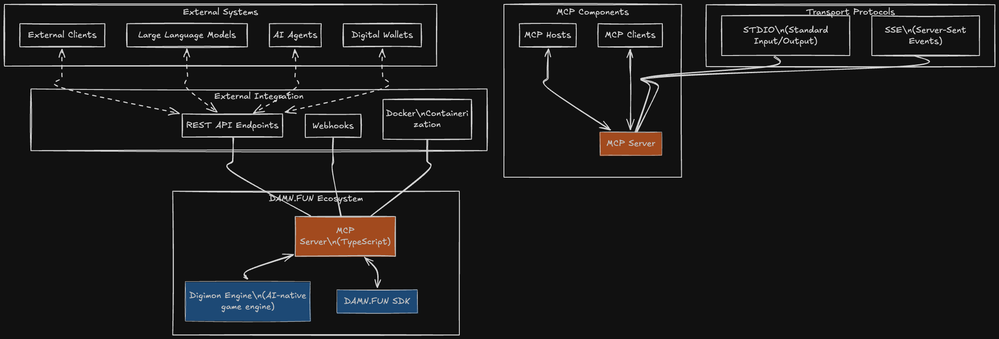

# 👾 Moteur Digimon 🧌

- [Documentation](https://docs.digimon.tech/digimon) : Apprenez à utiliser le Moteur Digimon pour créer vos propres jeux
- [Communauté des Dresseurs Digimon](https://docs.digimon.tech/digimon/community/welcome-aboard-digimon-trainers) : Rejoignez la communauté pour obtenir de l'aide et partager vos jeux
- [Jeu exemple : DAMN](https://damn.fun) : Jouez au jeu exemple créé avec le Moteur Digimon
  - [Stream en direct DAMN sur X](https://x.com/damndotfun/live) : Regardez le stream en direct du jeu
  - [Démo du Hackathon Solana AI](https://www.youtube.com/watch?v=NNQWY-ByZww) : Regardez la démo du jeu et du moteur

# 🌍 Traductions du README
[English](./README.md) | [简体中文](./README.zh-CN.md) | [繁體中文](./README.zh-TW.md) | [한국어](./README.ko-KR.md) | [日本語](./README.ja-JP.md) | [Deutsch](./README.de-DE.md) | [Français](./README.fr-FR.md) | [Português](./README.pt-BR.md) | [Italiano](./README.it-IT.md) | [Español](./README.es-ES.md) | [Русский](./README.ru-RU.md) | [Türkçe](./README.tr-TR.md) | [Polski](./README.pl-PL.md)

# Aperçu
## Moteur Digimon : Framework Multi-Agents, Multi-Joueurs pour les Jeux IA-Natifs et le Métavers Agentique
Le Moteur Digimon est une plateforme de jeu open-source similaire à Unreal Engine pour les jeux IA. Il prend en charge les agents IA sociaux et financiers, permettant un gameplay IA-natif immersif. Nous nous préparons à intégrer de nouveaux jeux avec des PNJ agents IA. Notre objectif est de créer un framework d'agents IA pour construire un environnement similaire à Westworld.

## Aperçu du Serveur MCP

Intégration transparente avec les **clients externes**, les **LLMs** et les **agents IA**, combinant les architectures du **protocole MCP**, du **SDK DAMN.FUN** et du **Moteur Digimon**. Cela inclut la construction de webhooks et de nouveaux points de terminaison REST API pour la création externe de jeux/agents, la propriété et la connectivité des portefeuilles.

  

- Composants clés de l'architecture MCP :
  - **Hôtes, Clients, Serveurs** : Conception modulaire pour l'évolutivité.
  - **Modèles de Transport** : STDIO (Entrée/Sortie Standard) + SSE (Événements envoyés par le serveur) pour la communication en temps réel.
  - **Langage & Runtime** : TypeScript pour la logique principale du serveur MCP.
  - **Déploiement** : Docker pour une mise à l'échelle conteneurisée et indépendante de l'environnement.

## Aperçu de l'Architecture

- Agents : Chaque monstre/agent possède une identité et des motivations uniques, parcourant le monde, conversant et formant des relations. À l'avenir, les agents feront référence aux interactions précédentes—extraites d'une base de données vectorielle (Pinecone) d'embeddings de mémoire—ainsi chaque conversation et décision sera informée par les rencontres passées (mémoire persistante).

- Moteur de Jeu : Le système d'orchestration planifie les activités des agents, gère les tâches "Exécution par Lots d'Agents" et gère les collisions. Lorsque les chemins de deux monstres sont prédits pour se croiser, le moteur les regroupe et déclenche une séquence de conversation. Une fois les tâches terminées, les agents redeviennent disponibles pour une nouvelle planification, assurant une activité continue du monde sans intervention manuelle.

- Journaux d'Événements : Un enregistrement en append-only suit tout—les chemins des agents, les horodatages des conversations et qui a parlé à qui. Avant de commencer un nouveau chemin, les monstres consultent leurs journaux d'événements pour prédire les collisions futures. S'ils n'ont pas discuté récemment avec un agent croisé, ils initient un dialogue. Les Journaux d'Événements stockent également toutes les transcriptions de conversations et les coordonnées pour un rappel précis du contexte et l'embedding de mémoire.

- Mémoire et Base de Données Vectorielle : Après les conversations ou les moments de réflexion, les agents résument leurs expériences et les stockent comme embeddings vectoriels (mxbai-embed-large). Ces embeddings peuvent être récupérés plus tard et filtrés par pertinence, injectant directement le contexte passé dans le prompt pour la prochaine conversation.

- L'un des défis fondamentaux dans la conception du moteur de jeu est de maintenir une faible latence tout en augmentant le nombre de joueurs et d'agents. C'est pourquoi DAMN introduit un état compressé (HistoryObject) pour suivre et rejouer efficacement les mouvements. Chaque tick du moteur (~60/sec) enregistre les champs numériques (comme la position), puis à la fin de chaque étape (1/sec), nous stockons un "tampon d'historique" compressé. Le client récupère à la fois les valeurs actuelles et ce tampon rejouable, rendant des animations fluides sans saccades. Impact : pour les joueurs et les agents, cette conception offre un gameplay fluide—pas de bégaiements ni d'animations saccadées. En coulisses, c'est une approche rationalisée qui maintient des performances élevées, reste fiable et s'adapte parfaitement pour plus de personnages pilotés par l'IA.

- Au lieu de s'appuyer sur un moteur de jeu existant (ex : Unity ou Godot), DAMN utilise un moteur de jeu IA-natif personnalisé construit à partir de zéro (écrit en TypeScript). Les agents IA et les joueurs humains sont traités de manière identique—pas de PNJ de seconde classe. À chaque tick, le moteur met à jour le monde entier en mémoire, donnant à l'IA les mêmes pouvoirs de déplacement, d'interaction et d'engagement que les humains. Cela conduit à des mondes plus organiques et dynamiques où l'IA ne suit pas simplement des scripts mais participe véritablement au gameplay.

- Aperçu de la Conception :
1. Le planificateur déclenche périodiquement une nouvelle étape de simulation.
2. Le moteur charge les données de jeu de la base de données en mémoire.
3. Les agents IA et les joueurs soumettent des actions ou des décisions, toutes traitées dans une boucle unifiée.
4. Après application des règles du jeu, le moteur calcule une "diff" des changements et la sauve dans la base de données.

Plus de détails peuvent être trouvés dans l'[Aperçu de l'Architecture](https://docs.digimon.tech/digimon/digimon-engine/architecture-overview).

# 💰 Lancer un jeu avec le Moteur Digimon et son token :

## N'oubliez pas de donner un pourboire de 10% au mignon Digimon
[Afcg6gaouRZTo8goQa3UhwGcBrtWkDj2NgpebtmjxBKf](https://solscan.io/account/Afcg6gaouRZTo8goQa3UhwGcBrtWkDj2NgpebtmjxBKf)

# Démarrage Rapide

### Prérequis

- [npm 11.0.0](https://www.npmjs.com/get-npm)
- [node 23.3.0](https://nodejs.org/en/download/)

### Communauté et contact

- [GitHub Issues](https://github.com/CohumanSpace/digimon-engine/issues) : Idéal pour : les bugs rencontrés en utilisant le Moteur Digimon et les propositions de fonctionnalités.
- [Discord](À venir) : Idéal pour : partager vos applications et échanger avec la communauté.
- [Discord Développeurs](À venir) : Idéal pour : obtenir de l'aide et le développement de plugins.

## Contributeurs

 