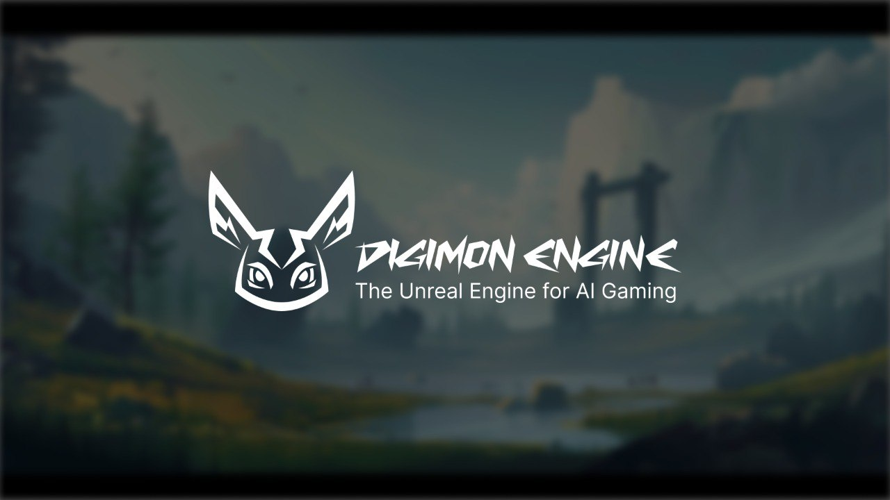

# 👾 Digimon Engine

- [Dokümantasyon](https://docs.digimon.tech/digimon): Kendi oyunlarınızı oluşturmak için Digimon Engine'i nasıl kullanacağınızı öğrenin
- [Digimon Eğitmenleri Topluluğu](https://docs.digimon.tech/digimon/community/welcome-aboard-digimon-trainers): Yardım almak ve oyunlarınızı paylaşmak için topluluğa katılın
- [Örnek Oyun: DAMN](https://damn.fun): Digimon Engine ile oluşturulmuş örnek oyunu oynayın
  - [DAMN X Canlı Yayını](https://x.com/damndotfun/live): Oyunun canlı yayınını izleyin
  - [Solana AI Hackathon Demosu](https://www.youtube.com/watch?v=NNQWY-ByZww): Oyun ve motorun demosunu izleyin

# 🌍 README Çevirileri
[English](./README.md) | [简体中文](./README.zh-CN.md) | [繁體中文](./README.zh-TW.md) | [한국어](./README.ko-KR.md) | [日本語](./README.ja-JP.md) | [Deutsch](./README.de-DE.md) | [Français](./README.fr-FR.md) | [Português](./README.pt-BR.md) | [Italiano](./README.it-IT.md) | [Español](./README.es-ES.md) | [Русский](./README.ru-RU.md) | [Türkçe](./README.tr-TR.md) | [Polski](./README.pl-PL.md)

# Genel Bakış
## Digimon Engine: Yapay Zeka Tabanlı Oyunlar ve Akıllı Metaverse için Çoklu-Ajan, Çok Oyunculu Framework
Digimon Engine, yapay zeka oyunları için Unreal Engine'e benzer bir açık kaynak oyun platformudur. Sosyal ve finansal YZ Ajanlarını destekleyerek, sürükleyici YZ tabanlı oyun deneyimi sunar. YZ Ajan NPC'leri içeren yeni oyunları entegre etmeye hazırlanıyoruz. Amacımız, Westworld benzeri bir ortam oluşturmak için bir YZ ajan framework'ü geliştirmektir.

## MCP Sunucu Genel Bakış

**Harici istemciler**, **LLM'ler** ve **YZ ajanları** ile sorunsuz entegrasyon, **MCP protokolü**, **DAMN.FUN SDK** ve **Digimon Engine** mimarilerini birleştirir. Bu, harici oyun/ajan oluşturma, sahiplik ve cüzdan bağlantısı için web kancaları ve yeni REST API uç noktalarının oluşturulmasını içerir.

  

- MCP mimarisinin temel bileşenleri:
  - **Ana Bilgisayarlar, İstemciler, Sunucular**: Ölçeklenebilirlik için modüler tasarım.
  - **Taşıma Modelleri**: Gerçek zamanlı iletişim için STDIO (Standart Giriş/Çıkış) + SSE (Sunucu Gönderilen Olaylar).
  - **Dil ve Çalışma Zamanı**: MCP Sunucu çekirdek mantığı için TypeScript.
  - **Dağıtım**: Konteynerleştirilmiş, ortamdan bağımsız ölçeklendirme için Docker.

## Mimari Genel Bakış

- Ajanlar: Her canavar/ajan benzersiz bir kimliğe ve motivasyona sahiptir, dünyada dolaşır, konuşur ve ilişkiler kurar. Gelecekte, ajanlar önceki etkileşimlerine başvuracak—hafıza gömme vektör veritabanından (Pinecone) çekilen—böylece her konuşma ve karar geçmiş deneyimlerle şekillenecek (kalıcı hafıza).

- Oyun Motoru: Orkestrasyon sistemi ajan aktivitelerini planlar, "Ajan Grubu Çalıştır" görevlerini yönetir ve çarpışmaları kontrol eder. İki canavarın yollarının kesişeceği tahmin edildiğinde, motor onları gruplar ve bir konuşma dizisi başlatır. Görevler tamamlandıktan sonra, ajanlar yeni planlamalar için tekrar müsait olur, manuel müdahale olmadan sürekli dünya aktivitesi sağlanır.

- Olay Günlükleri: Ekleme-tabanlı bir kayıt her şeyi takip eder—ajanların yolları, konuşma zaman damgaları ve kimin kiminle konuştuğu. Yeni bir yola başlamadan önce, canavarlar gelecekteki çarpışmaları tahmin etmek için olay günlüklerini kontrol eder. Kesişen bir ajanla yakın zamanda sohbet etmemişlerse, diyalog başlatırlar. Olay Günlükleri ayrıca doğru bağlam hatırlama ve hafıza gömme için tüm konuşma kayıtlarını ve koordinatları saklar.

- Hafıza ve Vektör Veritabanı: Konuşmalar veya düşünme anlarından sonra, ajanlar deneyimlerini özetler ve vektör gömmeler olarak saklar (mxbai-embed-large). Bu gömmeler daha sonra alınabilir ve ilgililik açısından filtrelenebilir, geçmiş bağlamı doğrudan bir sonraki konuşmanın promptuna ekler.

- Oyun motoru tasarımındaki temel zorluklardan biri, daha fazla oyuncu ve ajan için ölçeklenirken düşük gecikmeyi korumaktır. Bu yüzden DAMN, hareketi verimli bir şekilde izlemek ve tekrar oynatmak için sıkıştırılmış durum (HistoryObject) kullanır. Her motor tiki (~60/sn) sayısal alanları (konum gibi) kaydeder, ardından her adımın sonunda (1/sn) sıkıştırılmış bir "geçmiş tamponu" saklar. İstemci hem mevcut değerleri hem de bu tekrar oynatılabilir tamponu alır, sıçrama olmadan akıcı animasyonlar oluşturur. Etki: oyuncular ve ajanlar için bu tasarım akıcı oyun deneyimi sunar—takılma veya kesintili animasyon yok. Perde arkasında, bu yüksek performansı koruyan, güvenilir kalan ve daha fazla YZ güdümlü karakter için sorunsuz ölçeklenen optimize bir yaklaşımdır.

- Mevcut oyun motorlarına (örn: Unity veya Godot) güvenmek yerine, DAMN sıfırdan oluşturulmuş özel bir YZ tabanlı oyun motoru kullanır (Typescript ile yazılmış). YZ ajanları ve insan oyuncular eşit muamele görür—ikinci sınıf NPC'ler yok. Her tikte, motor tüm dünyayı bellekte günceller, YZ'ye insanlarla aynı hareket etme, etkileşim kurma ve katılma gücünü verir. Bu, YZ'nin sadece komut dosyalarını takip etmediği, gerçekten oyuna katıldığı daha organik, dinamik dünyalar yaratır.

- Tasarım Genel Bakışı:
1. Zamanlayıcı periyodik olarak yeni bir simülasyon adımı tetikler.
2. Motor oyun verilerini veritabanından belleğe yükler.
3. Hem YZ ajanları hem de oyuncular eylem veya kararlar gönderir, hepsi tek bir birleşik döngüde işlenir.
4. Oyun kurallarını uyguladıktan sonra, motor değişikliklerin bir "farkını" hesaplar ve veritabanına geri kaydeder.

Daha fazla detay [Mimari Genel Bakış](https://docs.digimon.tech/digimon/digimon-engine/architecture-overview)'da bulunabilir.

# 💰 Digimon Engine ve tokeni ile bir oyun başlatın:

## Lütfen sevimli Digimon'a %10 bahşiş vermeyi unutmayın
[Afcg6gaouRZTo8goQa3UhwGcBrtWkDj2NgpebtmjxBKf](https://solscan.io/account/Afcg6gaouRZTo8goQa3UhwGcBrtWkDj2NgpebtmjxBKf)

# Hızlı Başlangıç

### Ön Koşullar

- [npm 11.0.0](https://www.npmjs.com/get-npm)
- [node 23.3.0](https://nodejs.org/en/download/)

### Topluluk & İletişim

- [GitHub Issues](https://github.com/CohumanSpace/digimon-engine/issues). En uygun: Digimon Engine kullanırken karşılaştığınız hatalar ve özellik önerileri için.
- [Discord](Yakında). En uygun: Uygulamalarınızı paylaşmak ve toplulukla takılmak için.
- [Geliştirici Discord](Yakında). En uygun: Yardım almak ve eklenti geliştirmek için.

## Katkıda Bulunanlar

