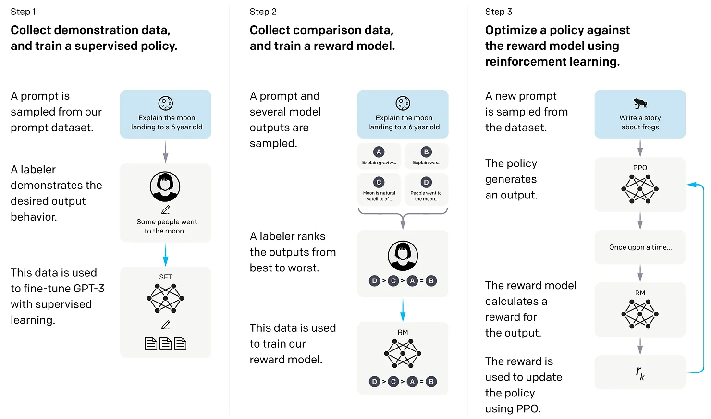

# MoEs, AB Testing and Reinforcement Learning

Forget about pre-training and fine-tuning large language models (LLMs) from scratch. We’re not here to reinvent the wheel — we’re here to make it spin faster and smarter. Enter **DAMN**, the Crowdsourced AI powered by [Mixture-of-Experts (MoE) architectures](https://arxiv.org/pdf/1701.06538). Guided by a gating model, as outlined in the original MoE paper, DAMN dynamically selects the right model for the right task, making it lean, agile, and incredibly efficient.

#### **How It Works**

At the heart of DAMN is our **LLM Router**, the **DAMN Controller** — a decision algorithm designed to seamlessly manage and route conversations to the most appropriate model. Given a set of conversations C, the controller maps them to a latent "feature space," tokenizes them, and determines the best "model space" to activate. In simple terms, it matches the problem to the perfect problem-solver — no wasted computation, no unnecessary complexity.

#### **Why It Matters**

Instead of relying on one massive, monolithic model, DAMN taps into a network of specialized experts. This results in faster response times, lower costs, and models that are better suited to specific tasks. It's like having a whole team of AI experts on standby, each ready to jump in when their specialty is needed.

#### **Where RLHF Comes In**

We also leverage **Reinforcement Learning from Human Feedback (RLHF)**, as outlined by OpenAI’s [landmark paper](https://arxiv.org/pdf/2203.02155). While OpenAI uses this process to train single, massive models, we apply it to optimize selection within our MoE framework. Our models improve continuously through a three-stage process:

1. **Supervised Fine-Tuning (SFT)** — Prepares a model with initial performance.
2. **Reward Model (RM) Training** — Creates a feedback loop to measure success.
3. **Reinforcement Learning (PPO)** — Optimizes models using feedback from the RM, ensuring every update makes the system sharper and more efficient.

<figure><figcaption></figcaption></figure>

<figure><figcaption></figcaption></figure>

* Model Ensembling & Blending

Why settle for one perspective when you can harness the power of many? Our approach to Model Ensembling & Blending brings together the strengths of multiple smaller base models, combining their unique insights into a single, unified powerhouse. This synergy not only enhances predictive accuracy but also rivals — and often surpasses — the performance of much larger, resource-intensive models. By leveraging this technique, we achieve smarter, faster, and more cost-efficient AI solutions without compromising on quality or scale.

<figure><figcaption></figcaption></figure>

We will reveal more details regarding our technology over time.

