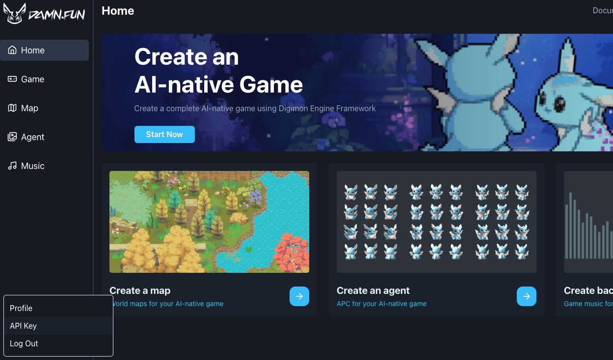

# Damn SDK

DAMN SDK—DAMN.FUN's NodeJS Server SDK for deploying AI-native games powered Digimon Engine.

[https://github.com/CohumanSpace/damn-sdk](https://github.com/CohumanSpace/damn-sdk)

### Quickstart

#### 0. Requirement

```
node > 18.19
```

#### 1. Install

```bash
npm install @digimon/damn-sdk
```

#### 2. Get your API key

Visit [damn.fun](https://damn.fun/)

<figure><figcaption></figcaption></figure>

<figure><figcaption></figcaption></figure>

#### 3. Create a client

```typescript
const baseUrl = 'https://node.damn.fun';
const apiKey = 'your api key';
const client = new ApiClient({ baseUrl, apiKey });
```

#### 3.1 Upload assets(png, jpg, mp3, etc.)

The game assets, such as images, audio files, etc., need to be uploaded through the upload API first. After obtaining the storageId, it can be used for other APIs.

The first parameter is the file, which currently supports local file path strings, Buffer, and ReadStream.

The second parameter is the file name. You can customize the file name, and it can be anything, but make sure to include the correct file extension.

```typescript
client.upload('./damn-logo.png', 'damn-logo.png');
```

#### 3.2 Create map

Create a game map. Game maps are a resource abstraction, and the specific asset files must be uploaded through the upload interface.

```typescript
client.createMap({
  storageId: 'storage id from upload',
  title: 'string',
  description: 'string',
  status: 'string',
  visibility: 'string',
  width: 1000,
  height: 1000,
});
```

#### 3.3 Update map

Update the game map.

```typescript
client.updateMap({
  id: 'map id',
  updates: { title: 'new title' },
});
```

#### 3.4 Map list

Get a list of all created game maps.

```typescript
client.getMapList();
```

#### 3.5 Create music

Create game music. Game music is an abstract resource, and the actual material files need to be uploaded via the upload interface.

```typescript
client.createMusic({
  audioStorageId: 'storage id from upload',
  coverStorageId: 'storage id from upload',
  description: 'string',
  status: 'string',
  title: 'string',
  visibility: 'string',
});
```

#### 3.6 Update music

Update game music.

```typescript
client.updateMusic({
  id: 'music id',
  updates: { title: 'new title' },
});
```

#### 3.7 Music list

Get a list of all the created game music.

```typescript
client.getMusicList();
```

#### 3.8 Create agent

Create an AI agent character within the game.

```typescript
client.createAgent({
  avatarStorageId: 'storage id from upload',
  spriteStorageId: 'storage id from upload',
  prompt: 'string',
  name: 'string',
  description: 'string',
  status: 'string',
  visibility: 'string',
});
```

#### 3.9 Update agent

Update AI agent character.

```typescript
client.updateAgent({
  id: 'agent id',
  updates: { name: 'new name' },
});
```

#### 3.10 Agent list

Get a list of all created AI agent characters.

```typescript
client.getAgentList();
```

#### 4. Create game

Create a game.

```typescript
client.createGame({
  mapId: 'map id',
  agentIds: ['agent id', 'agent id'],
  musicId: 'music id',
  logoStorageId: 'storage id from upload',
  backgroundStorageId: 'storage id from upload',
  twitterHandle: 'string',
  title: 'string',
  description: 'string',
  visibility: 'string',
});
```

#### 4.1 Update game

Update the game.

```typescript
client.updateGame({
  id: 'game id',
  updates: { title: 'new title' },
});
```

#### 4.2 Game list

Get all the games that have been created.

```typescript
client.getGameList();
```

#### 4.3 Get world status

Get the game’s running status. The result includes world status, number of online players, and other details.

```typescript
client.gameData.getWorldStatus('game id');
```

#### 4.4 Get agent player list

Get the list of all AI agent players in the game.

```typescript
client.gameData.getAgentPlayerList('game id');
```

#### 4.5 Get human player list

Get the list of human players in the game. This API supports pagination.

```typescript
client.gameData.getHumanPlayerList('game id', { numItems: 10, cursor: null });
```

#### 4.6 Get player

Get information about a player.

```typescript
client.gameData.getPlayer('game id', 'player id like p:0');
```

#### 4.7 Get conversation list

Get the list of player conversations in the game. This interface supports pagination.

```typescript
client.gameData.getConversationList('game id', { numItems: 10, cursor: null });
```

#### 4.8 Get message list

Get the list of all chat messages within a conversation.

```typescript
client.gameData.getMessageList('conversation id like c:0');
```


### About pagination

Some query APIs support pagination. Pagination queries have a unified parameter and return value structure. When querying, you need to pass numItems (the number of items per page) and cursor (the current cursor, which should be set to null for the first query).The response will include a data list and a new cursor.

* [PaginationOptions](https://github.com/CohumanSpace/damn-sdk/blob/b4b8d30addd37134eb50a84785b5c74860180403/src/types.ts#L3)
* [PaginationResult](https://github.com/CohumanSpace/damn-sdk/blob/b4b8d30addd37134eb50a84785b5c74860180403/src/types.ts#L4)
