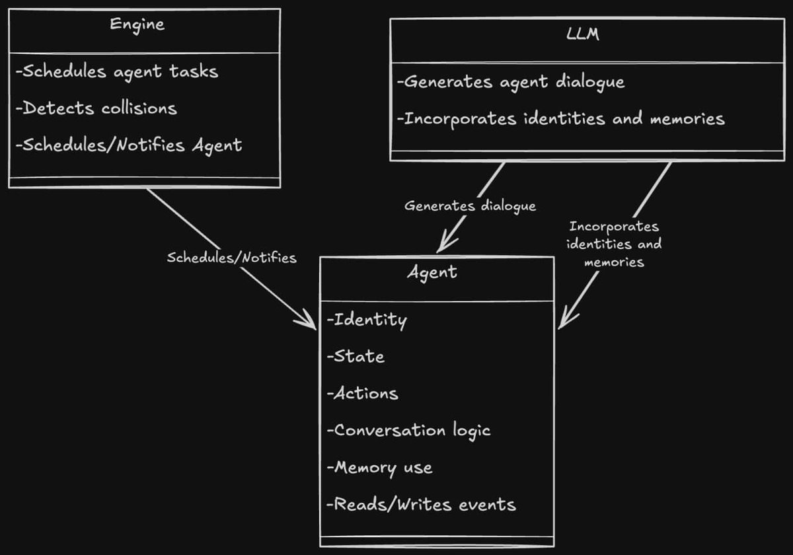
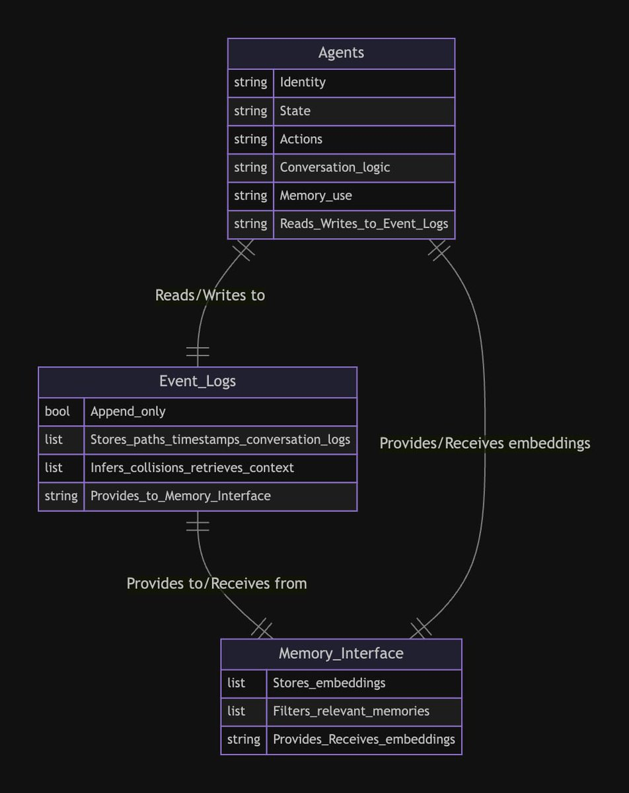
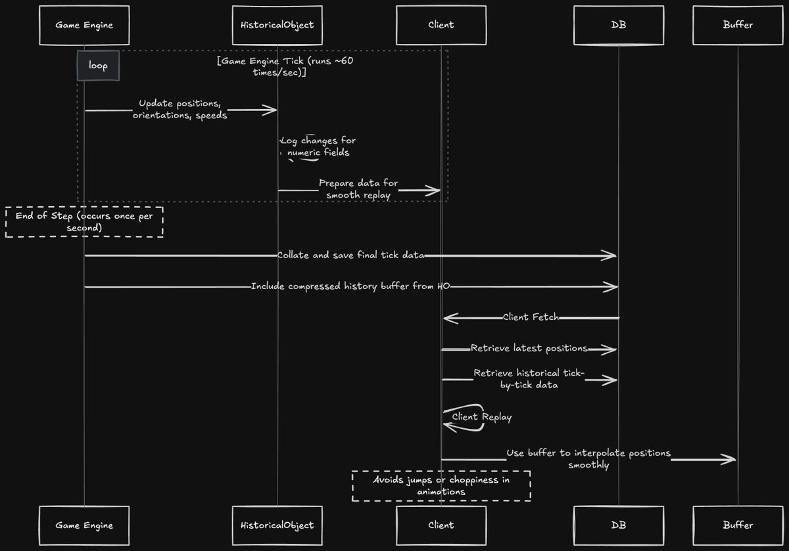
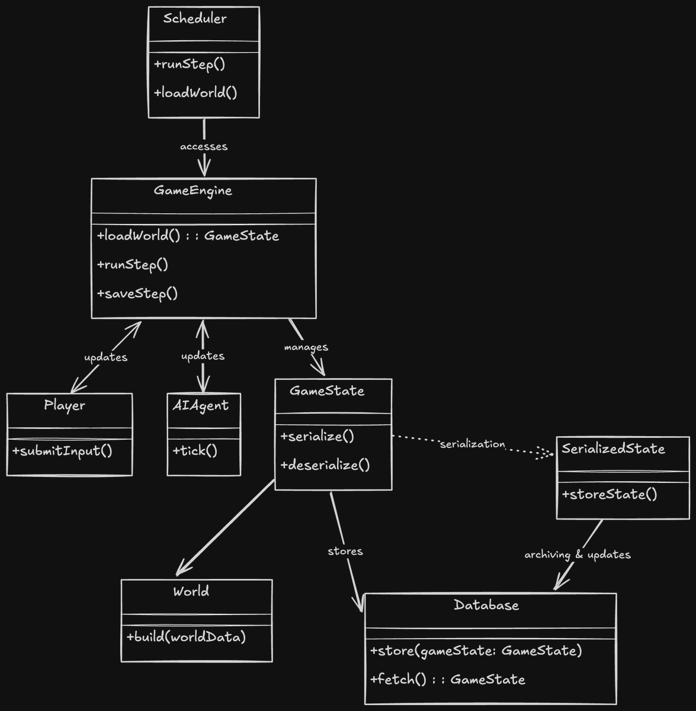

# Architecture Overview

<figure><figcaption>
Agent Engine
</figcaption></figure>

* Agents: Each monster/agent has a unique identity and motivations, roaming the world, talking, and forming relationships. In the future, agents would reference prior interactions—extracted from a vector database (Pinecone) of memory embeddings—so every conversation and decision is informed by past encounters (persistence memory).
* Game Engine: Orchestration system schedules agent activities, handles “Run Agent Batch” tasks, and manages collisions. Whenever two monsters’ paths are predicted to cross, the engine groups them and triggers a conversation sequence. After tasks wrap up, agents become available again for new scheduling, ensuring continuous world activity without manual intervention.

<figure><figcaption>
Memory
</figcaption></figure>

* Event Logs: An append-only record tracks everything—agents’ paths, conversation timestamps, and who spoke to whom. Before starting a new path, monsters consult their event logs to predict future collisions. If they haven’t chatted with an intersecting agent recently, they initiate dialogue. The Event Logs also stores all conversation transcripts and coordinates for accurate context recall and memory embedding.
* Memory & Vector Database: After conversations or reflective moments, agents summarize their experiences and store them as vector embeddings (mxbai-embed-large). These embeddings can be retrieved later and filtered for relevance, injecting past context directly into the prompt for the next conversation.

<figure><figcaption>
History Buffer Sync Flow
</figcaption></figure>

One of the core challenges in game engine design is keeping latency low while scaling to more players and agents. That’s why [DAMN](https://docs.digimon.tech/digimon/damn-evolvable-ai-agent-society) introduces a compressed state (HistoryObject) to efficiently track and replay movement. Each engine tick (\~60/sec) logs numeric fields (like position), then at the end of each step (1/sec) we store a compressed “history buffer.” The client fetches both current values and this replay-able buffer, rendering smooth animations without any jumps. Impact: for players and agents, this design delivers fluid gameplay—no stutters or choppy animations. Behind the scenes, it’s a streamlined approach that keeps performance high, stays reliable, and scales seamlessly for more AI-driven characters.

<figure><figcaption>
Scheduler Engine
</figcaption></figure>

Instead of relying on existing game engine (ex: Unity or Godot), [DAMN](https://docs.digimon.tech/digimon/damn-evolvable-ai-agent-society) uses a custom AI-native game engine built from scratch (written in Typescript). AI agents and human players are treated identically—no second-class NPCs. Every tick, the engine updates the entire world in memory, giving AI the same power to move, interact, and engage as humans. This leads to more organic, dynamic worlds where AI isn’t just following scripts but genuinely participating in the gameplay.&#x20;

#### Design Overview:&#x20;

1. Scheduler periodically triggers a new simulation step.
2. The engine loads game data from the database into memory.
3. Both AI agents and players submit actions or decisions, all handled in one unified loop. 4. After applying the game’s rules, the engine computes a “diff” of changes and saves it back to the database.
