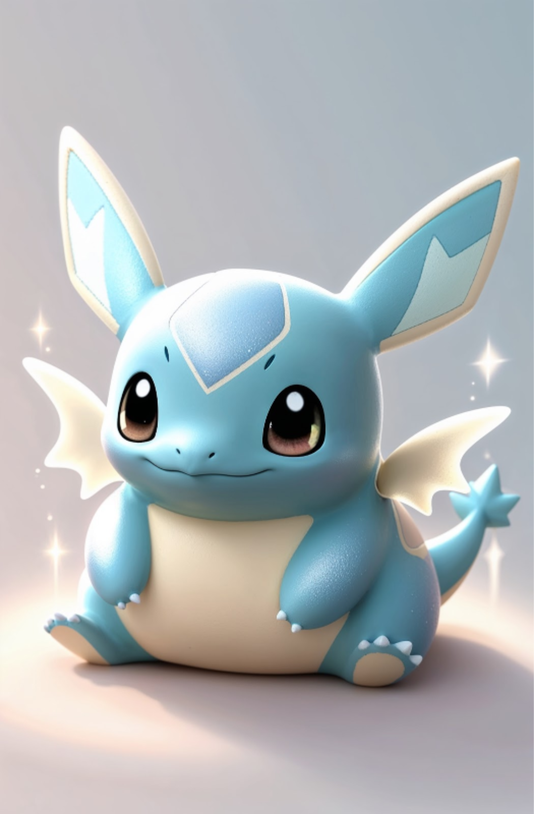
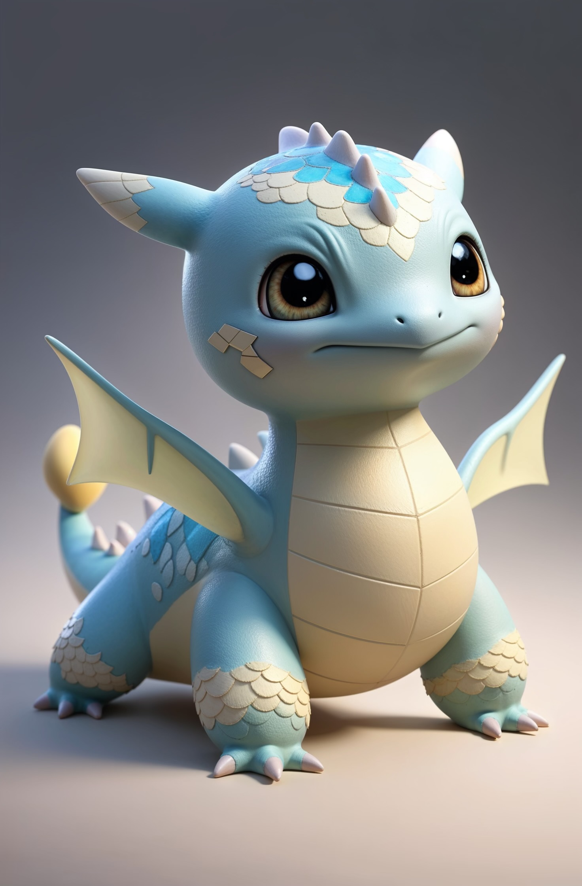
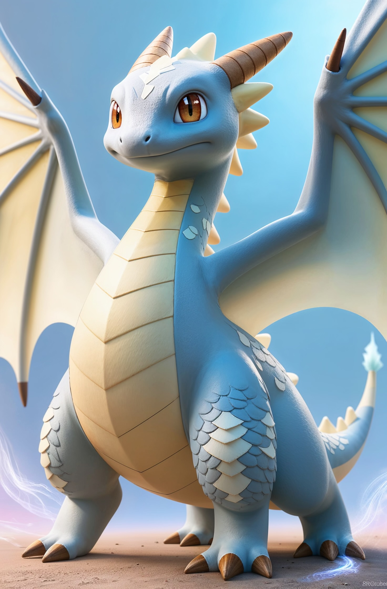

# Simulacra

With our vision painted earlier, we're building the [DigiWorld](https://docs.digimon.tech/digimon/technology/virtual-world-digiworld) sandbox with our [DAMN](https://docs.digimon.tech/digimon/technology/evolvable-ai-agent-damn).

The [DAMN](https://docs.digimon.tech/digimon/technology/evolvable-ai-agent-damn) sandbox world consists of major components, including but not limiting to:

1. Agent Avatar

* [Digimon Zoomie](https://www.digimon.tech/) (our 1st Digimon Monster) at different forms

<figure><figcaption>
Digimon Zoomie at Birth
</figcaption></figure>

<figure><figcaption>
Digimon Zoomie at $500K MC
</figcaption></figure>

<figure><figcaption>
Digimon Zoomie at $5M MC
</figcaption></figure>

* Digimon Evolution (each Agent is evolvable with new appearances, personalities, intelligence, and vibe)


Digimon Zoomie at Birth



Digimon Zoomie Evolution from Birth to 100K


2. Inter-Agent Communication

* Each monster in DAMN can interact with the world via their actions, and also with each other via natural language.

3. External Environment Input

* Players can input the navigation command to walk around, and interact with monsters via natural language.

4. Forming Social, Political, and Financial Connections

* Each monster will develop their thoughts and cognitive systems over time as a unit of a single generated agent in DAMN.
* Each monster is able to individually reason about the world. Monsters will develop more reasoning power as they form into families, regardless of Monogamy, Polygamy, or LGBTQ+. Over time, families of monsters can become a small gang, just hanging out on weekends or having TGIF parties. Gangs of monsters can evolve into tribes as they build up what's necessary to make a living in a village. These villages of monsters will then form a town, and each town has their own league and power system. Each town can have diplomatic departments, which can form political, social, and financial relationships with other towns to build a city. The evolution of the network can go on, from a city, a country, a state, a country, to a global of 200+ countries. What's next? To other planets!&#x20;
* How can monster nations on planet evolve individually while staying in touch with other planets? Stay tuned and play our game!

